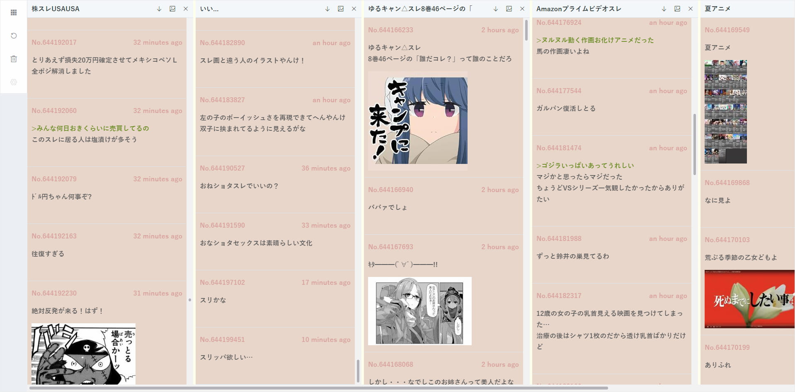

# NijiuraDeck



TweetDeck ライクに<a href="http://may.2chan.net/b/futaba.htm" target="_blank">二次元裏＠ふたば</a>を閲覧するためのビューアです。

<br>

# ステータス


# 機能

- [x] カタログ表示
- [x] スレ検索機能(タイトル検索、お気に入り検索)
- [x] スレッド表示
- [x] 自動更新
- [x] メディアフィルタ(画像)
- [ ] 設定変更(カタログ)
- [ ] ストリーミング
- [ ] 書き込み
- [ ] スレ立て
- [ ] そうだね

# 対応掲示板

- [x] may
- [ ] img
- [ ] dat

<br>

# 開発

## 最初にやること

```bash
git clone https://github.com/eiurur/NijiuraDeck
cd NijiuraDeck
npm install
npm run bootstrap
```

## 開発

```
npm run dev
```

and go to `http://127.0.0.1:9001`

## ビルド

```bash
npm run build

```

## Production Start

```bash
npm run start
```
